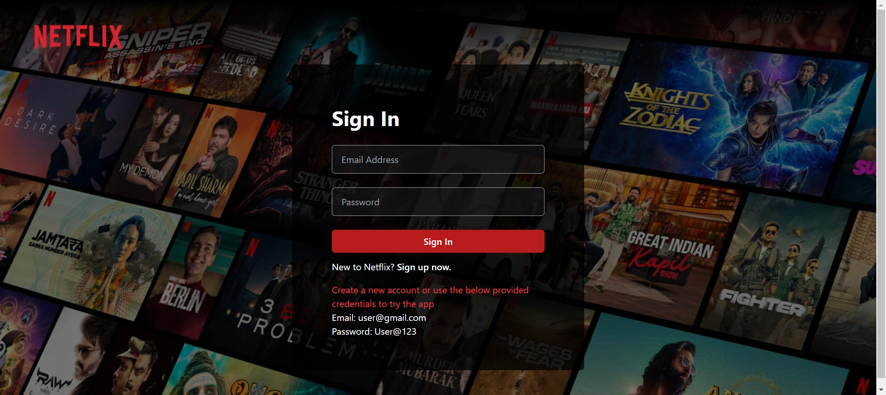
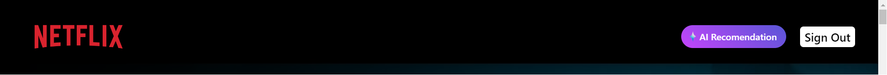
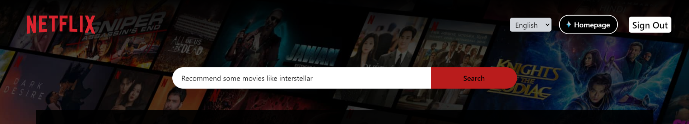

# 🎥 Netflix-GPT 🤖

**Overview**

This application is a Netflix-like web application that combines the features of Netflix and Gemini AI. It allows users to browse and search for movies and TV shows, and it also incorporates an AI-powered recommendation system using Google Gemini API. The application is built using React.js for the frontend, Tailwind CSS for styles and uses Firebase for user authentication.

> 🚀 [Deployed Link](https://netflix-gpt-vert-nu.vercel.app/browse) - Click here for live preview

**Features**

1. **User Authentication**:

   - Users can sign up and create an account using their email and password.
   - Users can sign in with their existing credentials.
   - Firebase Authentication is used for managing user accounts.

   

2. **Movie Browsing**:

   - Users can browse movies and TV shows categorized into different sections, such as "Now Playing," "Top Rated," "Popular," and "Upcoming Movies."
   - Movie data is fetched from the TMDB (The Movie Database) API.

3. **Video Background**:

   - The main featured movie on the homepage has a video background playing its trailer.
   - The trailer video is fetched from the TMDB API and embedded as a YouTube video.

4. **AI Recommendations**:

- Users can access the "AI Recommendation" feature by clicking on the corresponding button in the header.

  

- A search bar is provided, where users can enter a query related to their movie preferences or interests.
- The application sends the user's query to the OpenAI API (or Google Gemini API) and receives a list of recommended movie titles.

- For each recommended movie title, the application fetches the movie data from the TMDB API and displays it in a separate section.

5. **Language Support**:

   - The application supports multiple languages, including English, Hindi, Marathi, and Spanish.
   - Users can change the language from a dropdown menu in the header.
   - Translated strings are stored in a separate file (`langConstants.js`) and used throughout the application.

6. **Responsive Design**:
   - The application is designed to be responsive and works well on different screen sizes and devices.
   - CSS and Bootstrap are used for styling and responsive layout.

**Code Structure**

The application follows a modular structure with separate directories for components, hooks, utils, and other files.

1. **Components**:

   - `Body.js`: Sets up the routing for the application using React Router.
   - `Browse.js`: The main container component that renders the header, movie sections, and the AI recommendation feature.
   - `GptSearch.js`: Renders the search bar and movie suggestions for the AI recommendation feature.
   - `GptSearchBar.js`: Handles the search input and triggers the AI recommendation process.
   - `GptMovieSuggestions.js`: Displays the list of recommended movies based on the AI search results.
   - `Header.js`: Renders the application header with the logo, user profile, and language selection dropdown.
   - `Login.js`: Handles the user authentication flow (sign-in and sign-up) using Firebase Authentication.
   - `MainContainer.js`: Renders the main featured movie with its video background and title/overview.
   - `MovieCard.js`: Displays a single movie card with its poster image.
   - `MovieList.js`: Renders a list of movies in a horizontal scrollable container.
   - `SeconContainer.js`: Renders the movie sections for different categories (Now Playing, Top Rated, Popular, Upcoming Movies).
   - `VideoBg.js`: Renders the video background for the main featured movie using an embedded YouTube video.
   - `VideoTitle.js`: Displays the title and overview of the main featured movie, along with "Play Now" and "More Info" buttons.

2. **Hooks**:

   - `useMovieTrailer.js`: Fetches the trailer video data for a given movie ID and updates the Redux store.
   - `useNowPlayingMovies.js`: Fetches the "now playing" movies data from the TMDB API and updates the Redux store.
   - `usePopularMovies.js`: Fetches the popular movies data from the TMDB API and updates the Redux store.
   - `useTopRatedMovies.js`: Fetches the top-rated movies data from the TMDB API and updates the Redux store.
   - `useUpcomingMovies.js`: Fetches the upcoming movies data from the TMDB API and updates the Redux store.

3. **Utils**:
   - `store.js`: Sets up the Redux store and combines all the reducers.
   - `configSlice.js`: Defines the Redux slice for managing the application's configuration state (e.g., language).
   - `constants.js`: Exports various constants used throughout the application, such as API keys, URLs, and supported languages.
   - `firebase.js`: Sets up the Firebase configuration and exports the `auth` instance.
   - `gptSlice.js`: Defines the Redux slice for managing the GPT (AI recommendation) state.
   - `langConstants.js`: Exports an object containing language-specific strings for different languages.
   - `movieSlice.js`: Defines the Redux slice for managing the movie data state.
   - `userSlice.js`: Defines the Redux slice for managing the user authentication state.
   - `validate.js`: Exports a function for validating the email and password input fields.

**Data Flow**

1. **User Authentication**:

   - When a user signs up or signs in, the `Login` component interacts with the Firebase Authentication SDK.
   - Upon successful authentication, the user's information is stored in the Redux store using the `userSlice`.
   - The `Header` component checks the user's authentication state from the Redux store and displays the appropriate UI elements (user profile, sign-out button).

2. **Movie Data**:

   - Custom hooks (`useNowPlayingMovies`, `usePopularMovies`, `useTopRatedMovies`, `useUpcomingMovies`) are used to fetch movie data from the TMDB API.
   - The fetched movie data is stored in the Redux store using the `movieSlice`.
   - Components like `MainContainer`, `MovieList`, and `SeconContainer` access the movie data from the Redux store and render the appropriate UI elements.

3. **AI Recommendations**:

   - When a user enters a query in the `GptSearchBar` component, the `handleGptSearchClick` function is triggered.
   - The function constructs a prompt based on the user's query and sends it to the Google Gemini API.
   - The AI API responds with a list of recommended movie titles.
   - For each recommended movie title, the application fetches the corresponding movie data from the TMDB API.
   - The movie data and recommended movie titles are stored in the Redux store using the `gptSlice`.
   - The `GptMovieSuggestions` component reads the movie data and titles from the Redux store and renders the recommended movies.

4. **Language Support**:
   - The `Header` component provides a dropdown menu for language selection.
   - When a user selects a language, the `handleLanguageChange` function is triggered, which dispatches an action to update the language state in the Redux store using the `configSlice`.
   - Components that require language-specific strings (e.g., `GptSearchBar`) access the language state from the Redux store and retrieve the appropriate strings from the `langConstants` object.

## Languages and Tools

This application combines the features of a movie browsing platform like Netflix with an AI-powered recommendation system powered by Google Gemini APIs. It provides a smooth user experience with authentication, movie browsing, video backgrounds, and AI recommendations. The codebase is structured in a modular way, following React best practices and utilizing Redux for state management. The application also supports multiple languages and has a responsive design for various screen sizes.
